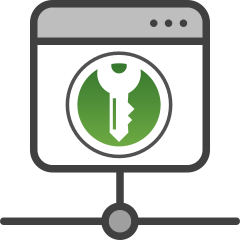

# keepassxc-proxy-access


[](https://github.com/purejava/keepassxc-proxy-access/actions?query=workflow%3A%22Java+CI+with+Maven%22)
[](https://app.codacy.com/gh/purejava/keepassxc-proxy-access?utm_source=github.com&utm_medium=referral&utm_content=purejava/keepassxc-proxy-access&utm_campaign=Badge_Grade)
[](https://search.maven.org/search?q=g:%22org.purejava%22%20AND%20a:%22keepassxc-proxy-access%22)
[](https://github.com/purejava/keepassxc-proxy-access/blob/master/LICENSE)
[](https://www.paypal.com/donate?hosted_button_id=XVX9ZM7WE4ANL)

A Java library to access KeePassXC via its build-in proxy.

# Dependency
Add `keepassxc-proxy-access` as a dependency to your project.
```maven
<dependency>
    <groupId>org.purejava</groupId>
    <artifactId>keepassxc-proxy-access</artifactId>
    <version>0.0.7</version>
</dependency>
```

# Usage
The library uses the JSON data format to communicate with KeePassXC. The underlying TweetNaCL crypto library provides the crypto_box functionality that is used to set up an encrypted and secure channel for the components to communicate with each other.

It's fast, easy to use and cross-platform.

Examples on how to use the library can be found in the Maven test classes.

You need to establish a connection to KeePassXC first:
```java
var kpa = new KeepassProxyAccess();
kpa.connect();
kpa.associate();
```
You'll get an AssociateID and the public key of an IDKeypair created during the initial connection.
Both pieces of data combined are needed for further connections. As both are public data, there is no need to store them securely.

# keepassxc-protocol
Communication with KeePassXC happens via the KeePassXC protocol. Currently, the following functionality is implemented:
*   `change-public-keys`: Request for passing public keys from client to server and back.
*   `get-databasehash`: Request for receiving the database hash (SHA256) of the current active database.
*   `associate`: Request for associating a new client with KeePassXC.
*   `test-associate`: Request for testing if the client has been associated with KeePassXC.
*   `generate-password`: Request for generating a password. KeePassXC's settings are used.
*   `get-logins`: Requests for receiving credentials for the current URL match.
*   `set-login`: Request for adding or updating credentials to the database.
*   `lock-database`: Request for locking the database from client.
*   `get-database-groups`: Request to retrieve all database groups together with their groupUuids.
*   `create-new-group`: Request to create a new group for the given name or path.
*   `get-totp`: Request for receiving the current TOTP.
*   `delete-entry`: Request for deleting an entry in the database, identified by its uuid (KeePassXC 2.7.0 and newer).
*   `request-autotype`: Request autotype from the KeePassXC database (KeePassXC 2.7.0 and newer).
*   `database-locked`: A signal from KeePassXC, the current active database is locked.
*   `database-unlocked`: A signal from KeePassXC, the current active database is unlocked.

# Donation
If you like this project, you can give me a cup of coffee :)

[](https://www.paypal.com/donate?hosted_button_id=XVX9ZM7WE4ANL)

# Copyright
Copyright (C) 2021-2022 Ralph Plawetzki

The keepassxc-proxy-access logo is based on an [ICONFINDER logo](https://www.iconfinder.com/icons/4484570/hosting_link_proxy_server_url_window_icon) that is published under the [Creative Commons Attribution 3.0 Unported licence](https://creativecommons.org/licenses/by/3.0/) (CC BY 3.0). I modified the icon to my needs by changing the interior and adding the KeePassXC logo.

The KeePassXC logo is Copyright (C) of https://keepassxc.org/
